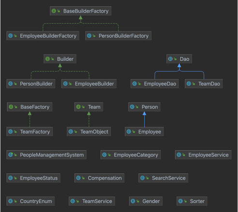

# People Management System

## Table of Contents

1. [Introduction](#introduction)
2. [Operational Instruction](#operational-instruction)
3. [Design Patterns](#design-patterns)
4. [Implementation](#implementation)
5. [UML Diagram](#uml-diagram)
6. [Knowledge Applied](#knowledge-applied)
7. [Future Enhancements](#future-enhancements)

## Introduction

The People Management System is an application designed to maintain records of the employees in a company. Some of its features include:

- A Login interface that enables access using username and password.
- A new user registration interface.
- Admin access to enable viewing and manage users.
- A search feature to search using various parameters.
- Teams interface to view and manage employees in individual teams.

## Operational Instruction

- IDE: Apache Netbeans 12.5, IntelliJ 2022.2.1
- JDK: JDK 18.1
- Technologies: MySQL database, Swing UI
- Design Patterns: Builder Design Pattern, Singleton Factory Design Pattern

## Design Patterns

### Factory Design Pattern

The factory method design pattern is a creational design pattern that defines an interface for creating an object, but let's subclasses decide which class to instantiate. It is a way to delegate the instantiation process to subclasses, which allows for greater flexibility and customization.

### Builder Design Pattern

The builder design pattern is a design pattern that allows for the creation of complex objects with constituent parts that are created in the same order or using the same signature. It is often used to create objects that have multiple optional parameters, or to create objects in a step-by-step fashion.

### Singleton Design Pattern

Cultivate one-to-one customer service with robust ideas. Maximize timely deliverables for real-time schemas.

## Implementation

First, we will start by explaining what DTO's did we have so majorly we had two DTOs which are Employee and Team. Since this project is about employee info management system with the possibilities of future functionalities, we need to keep a lot of user(Employee) data we wanted to get and set or build Employee objects easily which extends the Person DTO, a generic constructor will not fill this responsibilities easily as it will lower code readability and usability. We decided to go for Builder pattern just for the DTO's having numerous number of attribute fields, which would provide us with creating DTO's easily with no order for setting the attributes in-turn giving us flexibility when initializing its objects.

For developing DTOs which are flexible to build we used Factories which would provide us with different DTO builders. Thus, giving structure to Builders needed for complex Object creations. These Builder's are implementing a Builder Interface which is coupled with the Builder Factories. Thus, combining DTOs and their Builder, which are extending Person DTO.

## UML Diagram

## Knowledge Applied

- Builder Design Pattern
- Factory Design Pattern
- Lambda Expression
- Enums
- Singleton Design Pattern
- MYSQL
- JDBC APIs
- Inheritance
- Dao Layer
- Exception Handling
- Swing

## Future Enhancements

Future enhancements can use additional features like:

- Actively track and monitor holiday status of employees.
- Enable storing and retrieving HR documents.
- Create the functionality for Referrals.
- Create a talent pool for prospective employees.
- Track the open positions that is required to be filled.
- Budgeting option.

## Contributors

- Sayeed Ahmed - 002191535
- Mehul Natu - 002743870
- Natarajan Lekshmi Narayana Pillai - 002766033

##
